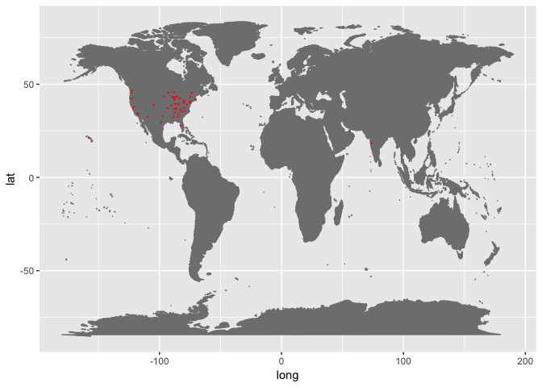
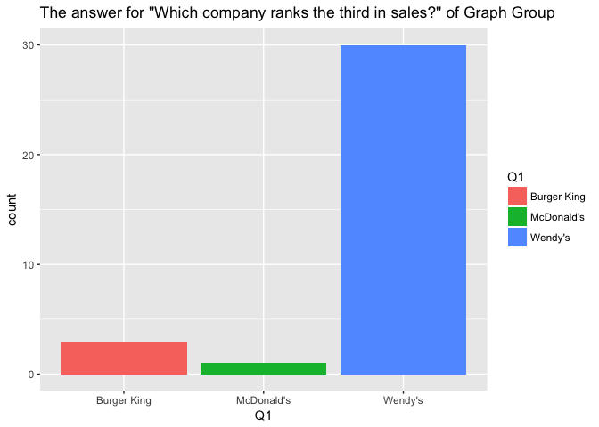
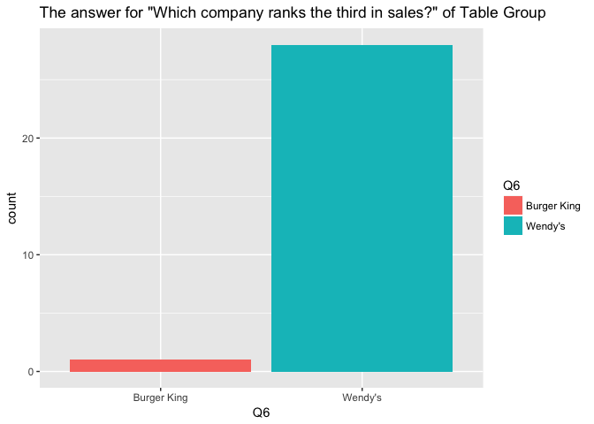
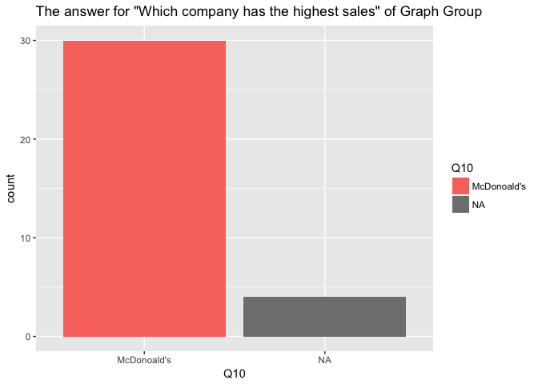
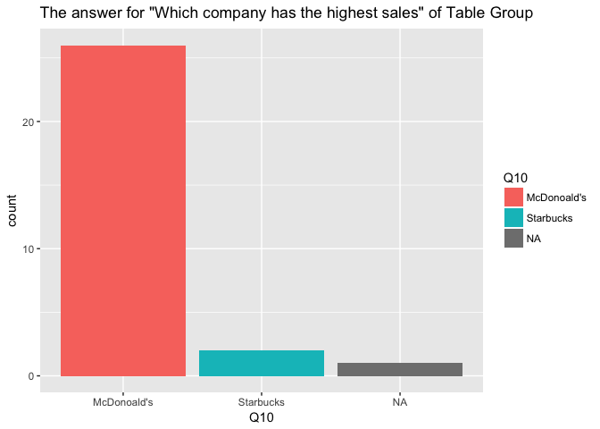
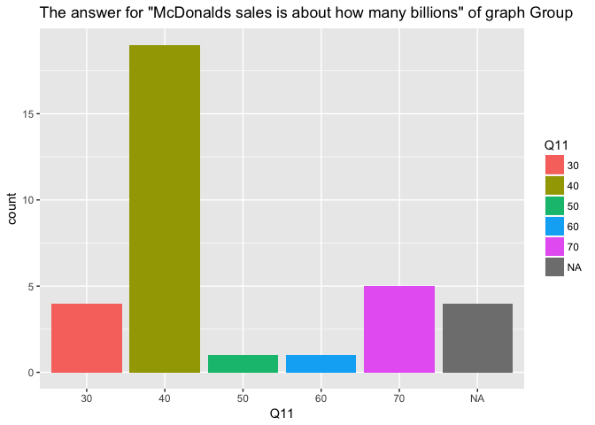
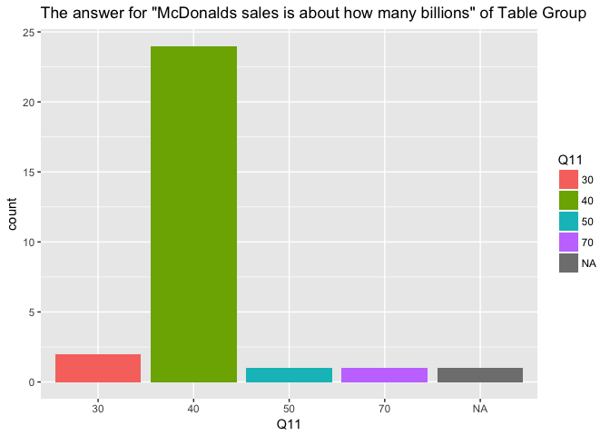

Survey Report
================

``` r
library(rworldmap)
library(tidyverse)
library("ggmap")
library(maptools)
library(maps)
library(graphics)
library(readxl)
library(readr)
setwd("~/cfss hw02/dataviz")
```

Project Overview
----------------

You can find the survey [here](http://ssd.az1.qualtrics.com/jfe/form/SV_6DoZpmklORF0v4N). Be sure to answer the first questions correctly otherwise you will not be able to proceed. You should try this survey at least two times so you can see our randomization at work.

For this project, we want to test whether graphs and tables are equally good tools of data visualization. Our hypothesis is that graphs should be more memorable because various psychology literature says that people retain better memory of graphical information. HOwever, we also hypothesize that graphs will be distracting, as people will focus their attention on the salient part of the graph but ignore the details such as actual numerical values on the y-axis. In contrast, we hypothesize that people will pay more attention to numbers if they are reading a table.

Experiment Setting
------------------

We set our experiment as the following. First, we randomly present to the participants a graph or a table contaiing the same information: total sales of various fast food restaurants. The we use the first question as a qualifying question, and only participants who correctly answered the first question will move forward. The first question, as well as the second question, also serve the purpose of drawing the participants attention on to the graph/table. Both of those questions are based on the information provided in the graph/table.

The we give the participants two small math problems so as to distract their attention and potentially weaken their memory of the graph/table they just saw.

Finally, we test the memory retention of the participants by two questions. First, we ask which company ranks the first in total sales. The number one company occupies a salient position in the graph. On the other hand, the number one company occupies the same row of the table, but the row is not so different from other rows. So we hypothesize that participants who read graphs will do better in this question than those who read tables. Second, we ask McDonald's sale is about how many billions. This question tests participants' attention and memory to numerical values. The actual numerical value obviously is not the focus of attention if the participants read the graph, but to the contrary if they read the table. So we hypothesize that those who read the table will do better on this numerical question.

Participants
------------

We have 63 partcipants in total. 62 of them are in the United States and the rest 1 is in India. I marked them on a world map.

``` r
dataset <- read_csv("~/cfss hw02/dataviz/submissions/David_Cheng/Assignment 2/Visualization+Survey_April+28,+2017_13.37.csv")

dataset <- dataset[-c(1,2),]

dataset$Latitude <- as.numeric(dataset$LocationLatitude)
dataset$Longitude <- as.numeric(dataset$LocationLongitude)

mp <- NULL
mapWorld <- borders("world", colour="gray50", fill="gray50") # create a layer of borders
mp <- ggplot() +   mapWorld

#Now Layer the cities on top
mp <- mp+ geom_point(aes(x=dataset$Longitude, y=dataset$Latitude) ,color="red", size=0.05) 
mp
```



2 different groups in the survey
--------------------------------

The 63 participants can be divided into 2 groups. The first one is the group in which the participants only saw the graph with trademarks. The participants in the other group only saw the table with the names of companeis and their sales. We call it "graph group" and "table group" respectively.

There are 34 participants in the "graph group" and 29 participants in the "table group".

The following code is to divide the result table into 2 tables reflecting the 2 groups.

``` r
graph_group <- filter(dataset, is.na(Q1)==FALSE)
table_group <- filter(dataset, is.na(Q6)==FALSE)
```

Which company ranks the third in sales?
---------------------------------------

The correct answer for this question is Wendy's. Most participants got the correct answer. 4 participants in the graph group gave the wrong answer. However, in the table group, only 1 participants gave the wrong answer. Compared with the total number of 60, I think these 5 participants who gave the wrong answer are just outliers.

``` r
graph_group$Q1 <- as.factor(graph_group$Q1)
graph_group$`Q14_Last Click` <- as.numeric(graph_group$`Q14_Last Click`)
ggplot(data = graph_group) + 
  stat_count(mapping = aes(x = Q1, fill=Q1))+
  ggtitle('The answer for "Which company ranks the third in sales?" of Graph Group')
```



``` r
table_group$Q6 <- as.factor(table_group$Q6)
ggplot(data = table_group) + 
  stat_count(mapping = aes(x = Q6, fill=Q6))+
  ggtitle('The answer for "Which company ranks the third in sales?" of Table Group')
```



``` r
avetime_2 <- mean(graph_group$`Q14_Last Click`)
```

Burger King's sale is about how many billions?
----------------------------------------------

This actually an invalid question as everone got the correct answer.

Which company has the highest sales
-----------------------------------

``` r
graph_group$Q10 <- as.factor(graph_group$Q10) 
ggplot(graph_group) + 
  stat_count(mapping = aes(x = Q10, fill=Q10))+
  ggtitle('The answer for "Which company has the highest sales" of Graph Group')
```



``` r
table_group$Q10 <- as.factor(table_group$Q10) 
ggplot(table_group) + 
  stat_count(mapping = aes(x = Q10, fill=Q10))+
  ggtitle('The answer for "Which company has the highest sales" of Table Group')
```



``` r
graph_group$`Q17_Page Submit` <- as.numeric(graph_group$`Q17_Page Submit`)
table_group$`Q17_Page Submit` <- as.numeric(table_group$`Q17_Page Submit`) 

mean(graph_group$`Q17_Page Submit`, na.rm = TRUE)
```

    ## [1] 4.4645

``` r
mean(table_group$`Q17_Page Submit`, na.rm = TRUE)
```

    ## [1] 4.966929

Every one in the graph group gave the right answer. 2 people in table group gave the wrong answer "starbucks". For this question, graph wins.

As for the time. The graph group took 4.4645 seconds to answer this question in average. However, it took the table group 4.966929 seconds in average. Obviously, the graph group is faster. In terms of showing the rank, the graph definitely has a better effect.

To sum up, according to the survey, the grap conveys the rank better.

McDonald's sales is about how many billions?
--------------------------------------------

``` r
graph_group$Q11 <- as.factor(graph_group$Q11) 
ggplot(graph_group) + 
  stat_count(mapping = aes(x = Q11, fill=Q11))+
   ggtitle('The answer for "McDonalds sales is about how many billions" of graph Group')
```



``` r
table_group$Q11 <- as.factor(table_group$Q11) 
ggplot(table_group) + 
  stat_count(mapping = aes(x = Q11, fill=Q11))+
  ggtitle('The answer for "McDonalds sales is about how many billions" of Table Group')
```



``` r
graph_group$`Q18_Page Submit` <- as.numeric(graph_group$`Q18_Page Submit`)
table_group$`Q18_Page Submit` <- as.numeric(table_group$`Q18_Page Submit`) 

mean(graph_group$`Q18_Page Submit`, na.rm = TRUE)
```

    ## [1] 4.6076

``` r
mean(table_group$`Q18_Page Submit`, na.rm = TRUE)
```

    ## [1] 4.321571

For this question, table group wins.

In terms of average time spent on this question, table group has the average time of 4.321571 seconds. For the graph group, the average time is 4.6076 seconds.

From the bar chart, it is quite obvisous that the table group gave much fewer wrong answer than the graph group.

Therefore, we can conclude that the table with statistics can better convey the numbers.

Conclusion
----------

The conclusion is pretty intuitive. Graps (especially the graphs have points with difference sizes) conveys the rank better.The table with statistics can better convey the numbers. We measure the effects of table and graph by the accuracy and speed of the people's memory.

The division of the work
------------------------

Xiaoran is mainly in charge of designing the questions of the survey and analyzing the results. Longxuan is mainly in charge of conducting the survey online.
