Test Stimuli
================
Soo Wan Kim
April 26, 2017

### Plot 1: Qualification test (Unmodified version)

``` r
set.seed(11111)

x1 <- runif(4, min = 3, max = 39)
id <- c("A", "B", "C", "D")
qualification <- as.data.frame(cbind(id, x1)) %>%
  transform(x1 = as.numeric(x1)*20)
```

### Plot 2: Normal bar chart, side by side comparison

``` r
dodged_side <- qualification %>%
  mutate(dot = ifelse(id == "B" | id == "C", x1/2, NA))

write_csv(dodged_side, "plot2.csv")
```

#### Treatment 1: Black and white

``` r
plot2bw <- ggplot(dodged_side, aes(id, x1)) + 
  geom_bar(stat = "identity", color = "black", fill = NA) + 
  scale_y_continuous(breaks = c(0, 100), limits=c(0,100)) + 
  geom_point(aes(id, dot)) + 
  theme_classic() + 
  theme(axis.ticks.x = element_blank(),
        axis.title.x = element_blank(),
        axis.title.y = element_blank(),
        axis.text = element_text(face = "bold", size = 16))

Cairo(file="plot2bw.png", 
      type="png",
      bg = "white",
      units="px", 
      width=380, 
      height=380,  
      dpi="auto")
plot2bw
```

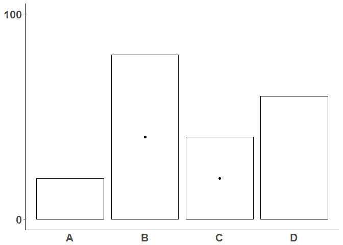

``` r
dev.off()
```

    ## png 
    ##   2

#### Treatment 2: All bars colored

``` r
plot2col <- ggplot(dodged_side, aes(id, x1)) + 
  geom_bar(stat = "identity", aes(fill = id), color = "black") + 
  scale_y_continuous(breaks = c(0, 100), limits=c(0,100)) + 
  geom_point(aes(id, dot)) + 
  theme_classic() + 
  theme(axis.ticks.x = element_blank(),
        axis.title.x = element_blank(),
        axis.title.y = element_blank(),
        axis.text = element_text(face = "bold", size = 16),
        legend.position = "None")

Cairo(file="plot2col.png", 
      type="png",
      bg = "white",
      units="px", 
      width=380, 
      height=380,  
      dpi="auto")
plot2col
```

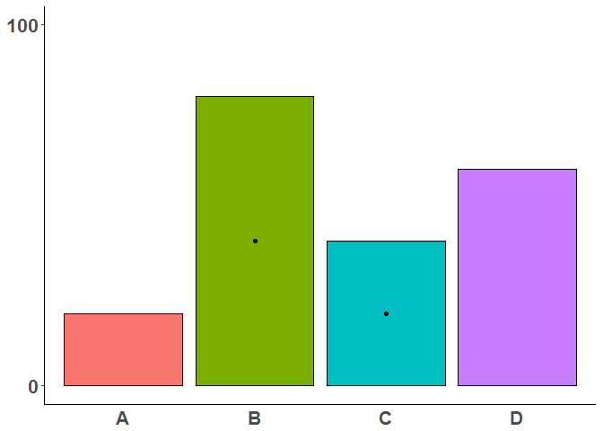

``` r
dev.off()
```

    ## png 
    ##   2

#### Treatment 3: Selectively colored

``` r
plot2sel <- ggplot(dodged_side, aes(id, x1)) + 
  geom_bar(stat = "identity", color = "black", alpha = 0.4, aes(fill = id)) + 
  scale_y_continuous(breaks = c(0, 100), limits=c(0,100)) + 
  scale_fill_manual(values=c("white", "blue", "blue", "white")) +
  geom_point(aes(id, dot)) + 
  theme_classic() + 
  theme(axis.ticks.x = element_blank(),
        axis.title.x = element_blank(),
        axis.title.y = element_blank(),
        axis.text = element_text(face = "bold", size = 16),
        legend.position = "None")

Cairo(file="plot2sel.png", 
      type="png",
      bg = "white",
      units="px", 
      width=380, 
      height=380,  
      dpi="auto")
plot2sel
```

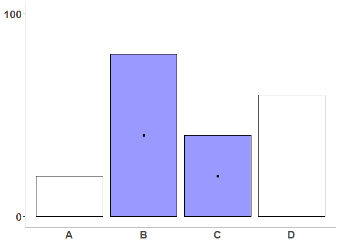

``` r
dev.off()
```

    ## png 
    ##   2

### Plot 3: Stacked bar chart, bottom comparison

``` r
set.seed(1212121)

x3 <- runif(8, min = 3, max = 39)
id <- c(rep(c("A"), 4), rep(c("B"), 4))
type <- rep(c("1", "2", "3", "4"), 2)

stacked_bottom <- as.data.frame(cbind(id, x3, type)) %>%
  transform(x3 = as.numeric(as.character(x3))) %>%
  transform(id = as.character(id)) %>%
  mutate(dot = ifelse(type == "4", x3/2, NA))

write_csv(stacked_bottom, "plot3.csv")
```

#### Treatment 1: Black and white

``` r
plot3bw <- ggplot(stacked_bottom, aes(id, x3)) + 
  geom_bar(stat = "identity", aes(group = type), fill = "NA", color = "black") + 
  scale_y_continuous(breaks = c(0, 100), limits=c(0,100)) + 
  geom_point(aes(id, dot)) + 
  theme_classic() + 
  theme(axis.ticks.x = element_blank(),
        axis.title.x = element_blank(),
        axis.title.y = element_blank(),
        axis.text = element_text(face = "bold", size = 16),
        legend.position = "None")

Cairo(file="plot3bw.png", 
      type="png",
      bg = "white",
      units="px", 
      width=380, 
      height=380,  
      dpi="auto")
plot3bw
```

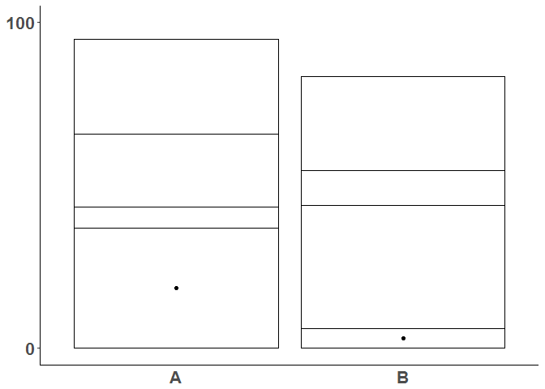

``` r
dev.off()
```

    ## png 
    ##   2

#### Treatment 2: All bars colored

``` r
plot3col <- ggplot(stacked_bottom, aes(id, x3)) + 
  geom_bar(stat = "identity", aes(group = type, fill = id), color = "black") + 
  scale_y_continuous(breaks = c(0, 100), limits=c(0,100)) + 
  geom_point(aes(id, dot)) + 
  theme_classic() + 
  theme(axis.ticks.x = element_blank(),
        axis.title.x = element_blank(),
        axis.title.y = element_blank(),
        axis.text = element_text(face = "bold", size = 16),
        legend.position = "None")

Cairo(file="plot3col.png", 
      type="png",
      bg = "white",
      units="px", 
      width=380, 
      height=380,  
      dpi="auto")
plot3col
```

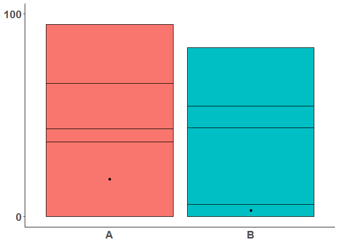

``` r
dev.off()
```

    ## png 
    ##   2

#### Treatment 3: Selectively colored

``` r
plot3sel <- ggplot(stacked_bottom, aes(id, x3)) + 
  geom_bar(stat = "identity", aes(fill = type), color = "black", alpha = 0.4) + 
  scale_y_continuous(breaks = c(0, 100), limits=c(0,100)) + 
  geom_point(aes(id, dot)) + 
  scale_fill_manual(values=c("white", "white", "white", "blue")) + 
  theme_classic() + 
  theme(axis.ticks.x = element_blank(),
        axis.title.x = element_blank(),
        axis.title.y = element_blank(),
        axis.text = element_text(face = "bold", size = 16),
        legend.position = "None")

Cairo(file="plot3sel.png", 
      type="png",
      bg = "white",
      units="px", 
      width=380, 
      height=380,  
      dpi="auto")
plot3sel
```

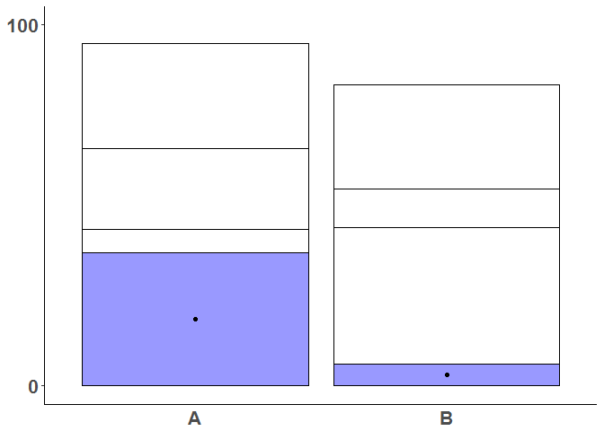

``` r
dev.off()
```

    ## png 
    ##   2

### Plot 4: Dodged bar chart, far apart comparison

``` r
set.seed(414141)

x4 <- runif(4, min = 3, max = 39)
id <- c("A", "B", "C", "D")
dodged_apart <- as.data.frame(cbind(id, x4)) %>%
  transform(x4 = as.numeric(as.character(x4))*2.6) %>%
  mutate(dot = ifelse(id == "A" | id == "D", x4/2, NA))

write_csv(dodged_apart, "plot4.csv")
```

#### Treatment 1: Black and white

``` r
plot4bw <- ggplot(dodged_apart, aes(id, x4)) + 
  geom_bar(stat = "identity", color = "black", fill = NA) + 
  scale_y_continuous(breaks = c(0, 100), limits=c(0,100)) + 
  geom_point(aes(id, dot)) + 
  theme_classic() + 
  theme(axis.ticks.x = element_blank(),
        axis.title.x = element_blank(),
        axis.title.y = element_blank(),
        axis.text = element_text(face = "bold", size = 16))

Cairo(file="plot4bw.png", 
      type="png",
      bg = "white",
      units="px", 
      width=380, 
      height=380,  
      dpi="auto")
plot4bw
```

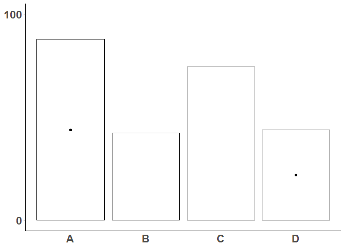

``` r
dev.off()
```

    ## png 
    ##   2

#### Treatment 2: All bars colored

``` r
plot4col <- ggplot(dodged_apart, aes(id, x4)) + 
  geom_bar(stat = "identity", color = "black", aes(fill = id)) + 
  scale_y_continuous(breaks = c(0, 100), limits=c(0,100)) + 
  geom_point(aes(id, dot)) + 
  theme_classic() + 
  theme(axis.ticks.x = element_blank(),
        axis.title.x = element_blank(),
        axis.title.y = element_blank(),
        axis.text = element_text(face = "bold", size = 16),
        legend.position = "None")

Cairo(file="plot4col.png", 
      type="png",
      bg = "white",
      units="px", 
      width=380, 
      height=380,  
      dpi="auto")
plot4col
```

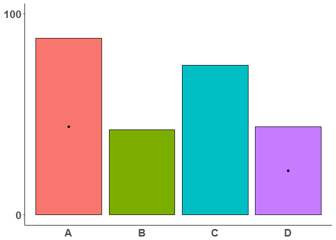

``` r
dev.off()
```

    ## png 
    ##   2

#### Treatment 3: Selectively colored

``` r
plot4sel <- ggplot(dodged_apart, aes(id, x4)) + 
  geom_bar(stat = "identity", color = "black", aes(fill = id), alpha = 0.4) + 
  scale_y_continuous(breaks = c(0, 100), limits=c(0,100)) + 
  scale_fill_manual(values = c("blue", "white", "white", "blue")) + 
  geom_point(aes(id, dot)) + 
  theme_classic() + 
  theme(axis.ticks.x = element_blank(),
        axis.title.x = element_blank(),
        axis.title.y = element_blank(),
        axis.text = element_text(face = "bold", size = 16),
        legend.position = "None")

Cairo(file="plot4sel.png", 
      type="png",
      bg = "white",
      units="px", 
      width=380, 
      height=380,  
      dpi="auto")
plot4sel
```

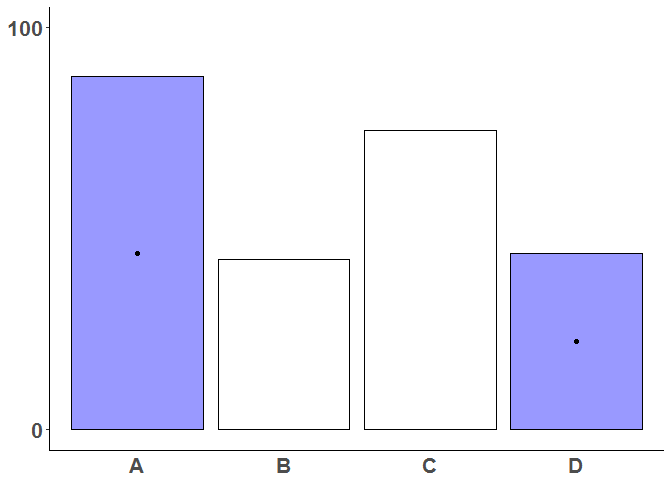

``` r
dev.off()
```

    ## png 
    ##   2

### Plot 5: Stacked bar chart, top comparison

``` r
set.seed(653)

x5 <- runif(8, min = 3, max = 39)
id <- c(rep(c("A"), 4), rep(c("B"), 4))
type <- rep(c("1", "2", "3", "4"), 2)

stacked_top <- as.data.frame(cbind(id, x5, type)) %>%
  transform(x5 = as.numeric(as.character(x5))) %>%
  mutate(id = as.character(id))

stacked_top_group <- stacked_top %>%
  group_by(id) %>%
  summarize(sum = sum(x5))

stacked_top <- left_join(stacked_top, stacked_top_group, by = "id") %>%
  mutate(dot = ifelse(type == "1", sum - x5/2, NA))

write_csv(stacked_top, "plot5.csv")
```

#### Treatment 1: Black and white

``` r
plot5bw <- ggplot(stacked_top, aes(id, x5)) + 
  geom_bar(stat = "identity", aes(group = type), fill = "NA", color = "black") + 
  scale_y_continuous(breaks = c(0, 100), limits=c(0,100)) + 
  geom_point(aes(id, dot)) + 
  theme_classic() + 
  theme(axis.ticks.x = element_blank(),
        axis.title.x = element_blank(),
        axis.title.y = element_blank(),
        axis.text = element_text(face = "bold", size = 16),
        legend.position = "None")

Cairo(file="plot5bw.png", 
      type="png",
      bg = "white",
      units="px", 
      width=380, 
      height=380,  
      dpi="auto")
plot5bw
```

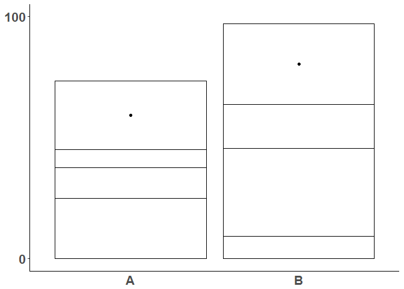

``` r
dev.off()
```

    ## png 
    ##   2

#### Treatment 2: All bars colored

``` r
plot5col <- ggplot(stacked_top, aes(id, x5)) + 
  geom_bar(stat = "identity", aes(group = type, fill = id), color = "black") + 
  scale_y_continuous(breaks = c(0, 100), limits=c(0,100)) + 
  geom_point(aes(id, dot)) + 
  theme_classic() + 
  theme(axis.ticks.x = element_blank(),
        axis.title.x = element_blank(),
        axis.title.y = element_blank(),
        axis.text = element_text(face = "bold", size = 16),
        legend.position = "None")

Cairo(file="plot5col.png", 
      type="png",
      bg = "white",
      units="px", 
      width=380, 
      height=380,  
      dpi="auto")
plot5col
```

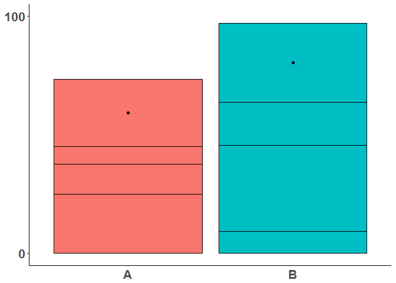

``` r
dev.off()
```

    ## png 
    ##   2

#### Treatment 3: Selectively colored

``` r
plot5sel <- ggplot(stacked_top, aes(id, x5)) + 
  geom_bar(stat = "identity", aes(fill = type), color = "black", alpha = 0.4) + 
  scale_y_continuous(breaks = c(0, 100), limits=c(0,100)) + 
  scale_fill_manual(values = c("blue", "white", "white", "white")) + 
  geom_point(aes(id, dot)) + 
  theme_classic() + 
  theme(axis.ticks.x = element_blank(),
        axis.title.x = element_blank(),
        axis.title.y = element_blank(),
        axis.text = element_text(face = "bold", size = 16),
        legend.position = "None")

Cairo(file="plot5sel.png", 
      type="png",
      bg = "white",
      units="px", 
      width=380, 
      height=380,  
      dpi="auto")
plot5sel
```

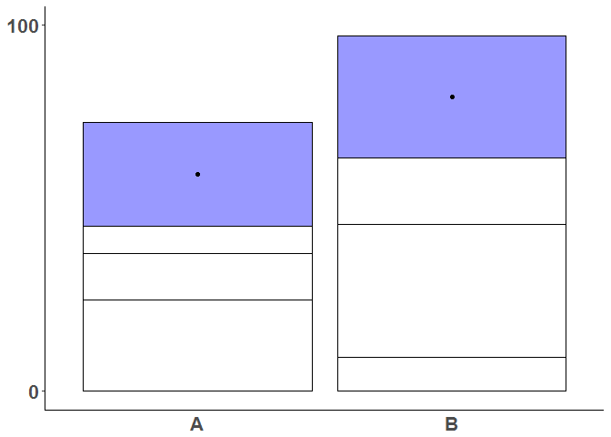

``` r
dev.off()
```

    ## png 
    ##   2

### Plot 6: Stacked bar chart, same bar comparison

``` r
set.seed(18187)

x6 <- runif(8, min = 3, max = 39)
id <- c(rep(c("A"), 4), rep(c("B"), 4))
type <- rep(c("1", "2", "3", "4"), 2)
rowid <- c(1,2,3,4,5,6,7,8)

stacked_same <- as.data.frame(cbind(id, x6, type, rowid)) %>%
  transform(x6 = as.numeric(as.character(x6))) %>%
  mutate(id = as.character(id))

stacked_same_group <- stacked_same %>%
  group_by(id) %>%
  summarize(sum = sum(x6))

stacked_same <- left_join(stacked_same, stacked_same_group, by = "id") %>%
  mutate(dot = ifelse(id == "A" & type == "1", sum - x6/2, NA)) %>%
  transform(dot = ifelse(id == "A" & type == "2", 
                         sum - stacked_same$x6[1] - x6/2, dot)) %>%
  transform(rowid = as.character(rowid))

write_csv(stacked_same, "plot6.csv")
```

#### Treatment 1: Black and white

``` r
plot6bw <- ggplot(stacked_same, aes(id, x6)) + 
  geom_bar(stat = "identity", aes(group = type), fill = "NA", color = "black") + 
  scale_y_continuous(breaks = c(0, 100), limits=c(0,100)) + 
  geom_point(aes(id, dot)) + 
  theme_classic() + 
  theme(axis.ticks.x = element_blank(),
        axis.title.x = element_blank(),
        axis.title.y = element_blank(),
        axis.text = element_text(face = "bold", size = 16),
        legend.position = "None")

Cairo(file="plot6bw.png", 
      type="png",
      bg = "white",
      units="px", 
      width=380, 
      height=380,  
      dpi="auto")
plot6bw
```

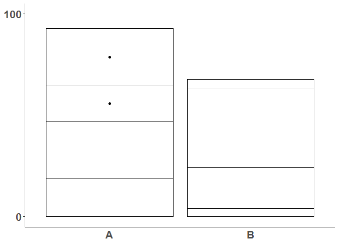

``` r
dev.off()
```

    ## png 
    ##   2

#### Treatment 2: All bars colored

``` r
plot6col <- ggplot(stacked_same, aes(id, x6)) + 
  geom_bar(stat = "identity", aes(group = type, fill = id), color = "black") + 
  scale_y_continuous(breaks = c(0, 100), limits=c(0,100)) + 
  geom_point(aes(id, dot)) + 
  theme_classic() + 
  theme(axis.ticks.x = element_blank(),
        axis.title.x = element_blank(),
        axis.title.y = element_blank(),
        axis.text = element_text(face = "bold", size = 16),
        legend.position = "None")

Cairo(file="plot6col.png", 
      type="png",
      bg = "white",
      units="px", 
      width=380, 
      height=380,  
      dpi="auto")
plot6col
```

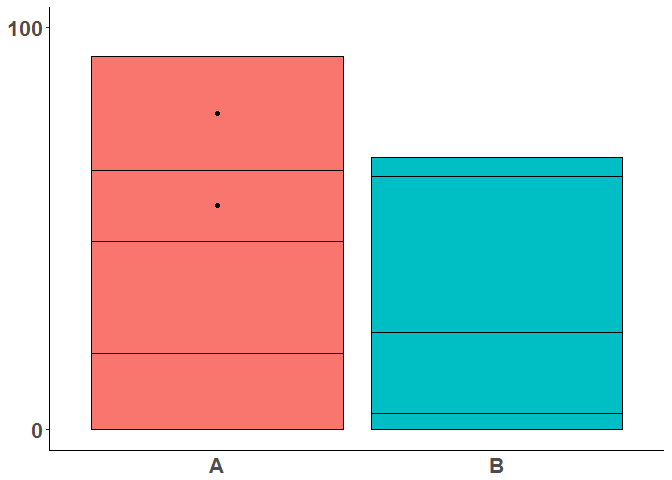

``` r
dev.off()
```

    ## png 
    ##   2

#### Treatment 3: Selectively colored

``` r
plot6sel <- ggplot(stacked_same, aes(id, x6)) + 
  geom_bar(stat = "identity", aes(group = type, fill = rowid), color = "black", alpha = 0.4) + 
  scale_y_continuous(breaks = c(0, 100), limits=c(0,100)) + 
  scale_fill_manual(values = c("blue", "blue", rep("white", 6))) + 
  geom_point(aes(id, dot)) + 
  theme_classic() + 
  theme(axis.ticks.x = element_blank(),
        axis.title.x = element_blank(),
        axis.title.y = element_blank(),
        axis.text = element_text(face = "bold", size = 16),
        legend.position = "None")

Cairo(file="plot6sel.png", 
      type="png",
      bg = "white",
      units="px", 
      width=380, 
      height=380,  
      dpi="auto")
plot6sel
```

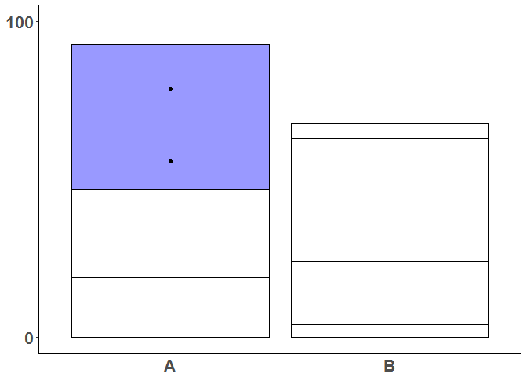

``` r
dev.off()
```

    ## png 
    ##   2
