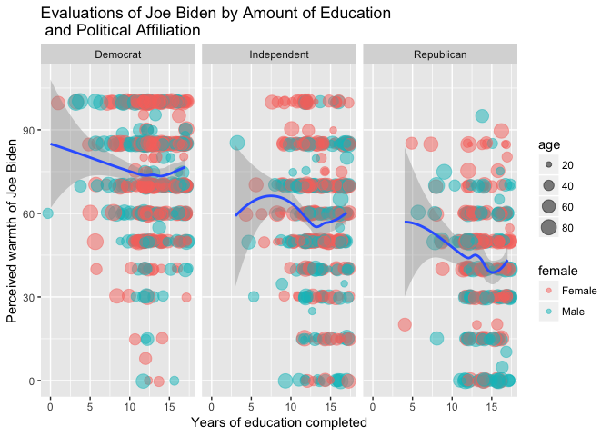
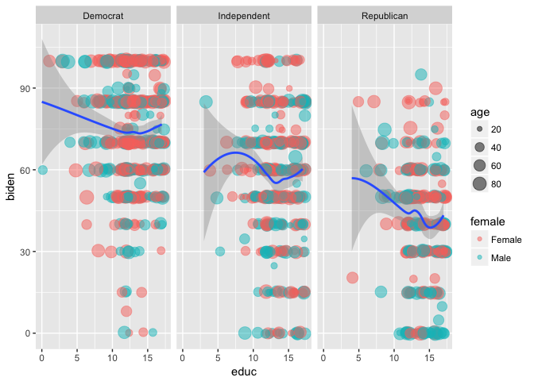

Untitled
================

Part 2
======

Source code
-----------

``` r
library(tidyverse)
```

    ## Loading tidyverse: ggplot2
    ## Loading tidyverse: tibble
    ## Loading tidyverse: tidyr
    ## Loading tidyverse: readr
    ## Loading tidyverse: purrr
    ## Loading tidyverse: dplyr

    ## Conflicts with tidy packages ----------------------------------------------

    ## filter(): dplyr, stats
    ## lag():    dplyr, stats

``` r
data <- read.csv("data/biden.csv", stringsAsFactors=TRUE)
bidenset <- data
bidenset$polcategory[bidenset$dem==1] <- "Democrat"
bidenset$polcategory[bidenset$rep==1] <- "Republican"
bidenset$polcategory[bidenset$rep==0 & bidenset$dem==0] <- "Independent"
bidenset$female[bidenset$female==1] <- "Female"
bidenset$female[bidenset$female==0] <- "Male"

ggplot(data = bidenset) +
  geom_point(mapping = aes(x = educ, y = biden, color = female, size = age), position = 'jitter', alpha = .5) +
  facet_wrap(~ polcategory, nrow = 1) +
  geom_smooth(mapping = aes(x = educ, y = biden))
```

    ## `geom_smooth()` using method = 'loess'


``` r
bidenplot <- ggplot(data = bidenset) +
  geom_point(mapping = aes(x = educ, y = biden, color = female, size = age), position = 'jitter', alpha = .5) +
  facet_wrap(~ polcategory, nrow = 1) +
  geom_smooth(mapping = aes(x = educ, y = biden))

bidenplot +
  xlab("Years of education completed") +
  ylab("Perceived warmth of Joe Biden") +
  ggtitle("Evaluations of Joe Biden by Amount of Education \n and Political Affiliation ")
```

    ## `geom_smooth()` using method = 'loess'



``` r
plot(bidenplot)
```

    ## `geom_smooth()` using method = 'loess'



Is it truthful?
---------------

Yes. My axes are clearly labeled, and I collapsed the "democrat" and "republican" variables from the original set into a better, clearer variable that descriptively measures political affiliation as not only Republican and Democrat, but also including those who did not identify with either party as "Independents". I was sure to note that the y axis is measuring perceived warmth as opposed to a more objective measure, in order to be clear to the reader that the data does not attempt to capture approval or anything other than simple warm/cold perception. The axes are unmanipulated and, given that they are subjective and relative measures, meant to provide spatial semantic context as opposed to objective meaning. The use of visible confidence intervals in the soothing line allows for the graph to be truthful and understandable even among the more under-represented members of the sample (those who have received very little formal education).

Is it functional?
-----------------

I would assert that, especially as a scatterplot, this graph is highly functional. The use of a soothing line with a confidence interval allows for an overall at-a-glimpse narrative that makes it easy to see the overall point of the graph (that perceptions of Joe Biden are dynamic across level of education, and that they vary significantly between Republicans, Democrats, and Independents). Once the overarching narrative has been parsed, there are also numerous other pieces of data to explore, which I believe have been presented in a very functional fashion. The difference that age makes can be seen as a function of relative size of the points. For example, one can see that older Democrats are clustered at the top of the graph across education levels, while younger Democrats seem to perceive less warmth. Gender is drawn clearly with contrasting colors, indicating that the adage that Joe Biden has a strong appeal to women may indeed be grounded in reality. Despite the amount of points and data collected within the visual element of these geoms, using a diminished alpha value and jittered points allows for one to literally see through the data to understand what it happening inside these dense clusters.

Is it beautiful?
----------------

I would certainly defend the notion that this is a beautiful piece of data. Though there are numerous clusters of points of data, my use of a 50% alpha value and jitter of the lines allows for one to rather clearly sift through these datapoints. In addition, the use of color in denoting gender creates a somewhat kaliedosopic array that draws in the viewer to see what densely red regions mean when compared to more blue or greenish regions. Without the alpha effect, this graph would run the risk of being sloppy and obscure, but the effect instead contributes strongly to the beauty of the graph. Additionally, turning gender into a categorical instead of numeric value allowed for the use of the bold red and blue colors.

Is it insightful?
-----------------

Yes. At a glance, the smooth geom line allows for an immediate insight into not only how education and perception of warmth are related, but also for an easy comparison across political party affilitation conditions. The "a-ha" moment for this chart should be immediate. Similarly, the gender insight is strong as one simply needs to glance at the key and pay attention to see that women and men, specifically Democrat women, seem to differ on their perception of Biden. That being said, the graph is somewhat less insightful about age largely due to the clustered nature of the points and the wide range of ages in the sample. That being said, a close look does show an age divide in which younger Democrats are more skeptical of Joe Biden while young Independents and young Republicans perceive more warmth from Biden than their older counterparts.

Is it enlightening?
-------------------

The way in which the graph dips at the end of high school only to steadily rise through college may suggest that there's something going on with high school and college completion. Those who do not receive an undergraduate degree appear to have less favorable views of Biden, even when they are members of his same party. This can be due to a number of situations but may show that those who are not academic or cultural elites (assuming that status is conferred by an undergraduate degree) perceive less sympathy from Biden who is often conferred the status of "Democrat elitist". Digging through this data also shows that Biden had somewhat of a favorable following among younger Republicans and younger Indepedents, potentially suggesting that he could have brought it more non-Democrat voters than Clinton was able to (had he run). This graph is an enlightening vision of a multifaceted data network that looks at the effects of education and party.
